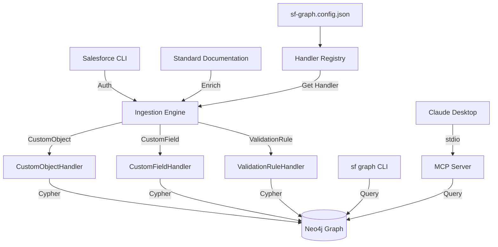

# sf-graph

> [!WARNING]
> **⚠️ Work in Progress — Early Alpha**
>
> This project is under active development. Expect breaking changes, incomplete features, and bugs.
> Not recommended for production use. Contributions and feedback welcome!


**sf-graph** is an intelligent graph engine that maps your Salesforce Org's **schema** (Objects, Fields, Relationships, Validation Rules) into a Neo4j graph database. It provides a **Salesforce CLI plugin**, a **REST API**, and a [Model Context Protocol (MCP)](https://modelcontextprotocol.io/) server, enabling AI agents to reason about your Salesforce data model.

## 📊 Development Status

| Area | Status | Notes |
|------|--------|-------|
| CLI Plugin | 🟡 Beta | Core sync/query commands stable |
| MCP Server | 🟡 Beta | Most tools functional |
| AI/SOQL Generation | 🟠 Alpha | Good architecture, but output quality varies |
| Graph Visualization | 🔴 Experimental | Basic visualization, incomplete features |
| REST API | 🟠 Alpha | Limited testing |
| Multi-Org Support | 🔴 Experimental | Schema comparison in progress |

**Legend:** 🟢 Stable | 🟡 Beta | 🟠 Alpha | 🔴 Experimental

---

## 🎯 Scope & Purpose

> [!IMPORTANT]
> **This tool maps Schema, not Record Data.**

- ✅ **What it DOES**: Fetches **Metadata** (e.g., `Account` Object definition, `MyField__c` Field definition, `MyRule` Validation Rule) and graphs how they relate to each other.
- ❌ **What it is NOT**: It is **NOT** a data backup tool. It does not fetch the actual `contact@example.com` or `Big Company Inc` records.

**Why use this?**

- **Visualizing Complexity**: See how thousands of custom objects and fields interrelate.
- **AI Context**: Give your AI agents a "map" of your CRM so they can write accurate SOQL queries without halluncinating field names.
- **Impact Analysis**: Query the graph to see what breaks if you delete a field.
- **Multi-Org Comparison**: Compare schemas between sandbox and production.

## 🏗 Architecture



## 🚀 Quickstart

### Prerequisites

- Node.js (v18+)
- Docker Desktop (for Neo4j 5.11+ with vector index support)
- Salesforce CLI (`npm install -g @salesforce/cli`)
- A Salesforce Org (Production or Sandbox)
- **Ollama** (v0.3+) with models:
  - `qwen2.5:3b` (Fast/Router)
  - `qwen2.5-coder:14b` (Strong/Coder)

### 1. Installation

```bash
git clone https://github.com/nwant/sf-graph.git
cd sf-graph
npm install

# Link as SF CLI plugin
sf plugins link .
```

### 2. Authenticate with Salesforce CLI

```bash
# Authenticate your org (opens browser for OAuth)
sf org login web --alias my-org

# Verify authentication
sf org list
```

### 3. Configuration

Configure Neo4j and Salesforce settings using the CLI:

```bash
# Configure Neo4j connection (interactive)
sf graph db config
# Or manually:
sf graph config set neo4jUri bolt://localhost:7687
sf graph config set neo4jPassword your-password
# Optional: Set custom data path for Neo4j persistence
sf graph config set neo4jDataPath /path/to/data

# Set default Salesforce org
sf graph org config
# Or manually:
sf graph config set defaultOrg my-org

# (Optional) Configure LLM provider for natural language features
sf graph ai config
```

> [!NOTE]
> **No Salesforce credentials needed!** Authentication is handled securely via the Salesforce CLI.

### 4. Start Neo4j and Sync

```bash
# Start Neo4j Database (uses docker compose)
sf graph db start

# Sync metadata from your org
sf graph sync --target-org my-org

# With progress reporting
sf graph sync --target-org my-org --progress

# Rebuild from scratch (clears existing data first)
sf graph sync --target-org my-org --rebuild

# Stop Neo4j Database when done
sf graph db stop
```

## 🖥️ CLI Commands

The `sf graph` plugin provides powerful commands for working with your metadata graph.

### Core Commands

| Command            | Description                                      |
| ------------------ | ------------------------------------------------ |
| `sf graph status`  | Check if the graph is populated and sync status  |
| `sf graph sync`    | Sync Salesforce metadata to Neo4j                |
| `sf graph explore` | Interactive TUI for navigating metadata graph    |
| `sf graph query`   | Execute a raw Cypher query against the graph     |

#### Sync Options

| Flag | Description |
| ---- | ----------- |
| `-c, --concurrency` | Parallel Salesforce API calls (1-25, default: 10) |
| `--batch-size` | Neo4j batch write size (10-200, default: 150) |
| `-p, --progress` | Show detailed progress updates |
| `-i, --incremental` | Soft-delete missing objects instead of ignoring |
| `--rebuild` | Clear all org data before syncing |
| `--docs` | Apply standard documentation to objects and fields |

> 💡 Navigate your metadata graph visually! See [docs/explorer.md](docs/explorer.md) for keybindings and features.

### Configuration Management

Manage all settings via CLI commands instead of environment files:

| Command | Description |
| ------- | ----------- |
| `sf graph config list` | View all configuration settings |
| `sf graph config get <key>` | Get a specific configuration value |
| `sf graph config set <key> <value>` | Set a configuration value |
| `sf graph config unset <key>` | Remove a configuration value |
| `sf graph config reset` | Reset all configuration to defaults |

**Interactive Wizards:**

| Command | Description |
| ------- | ----------- |
| `sf graph ai config` | Configure LLM provider (OpenAI, Claude, Gemini, Ollama) |
| `sf graph db config` | Configure Neo4j database connection |
| `sf graph org config` | Set default Salesforce org |

```bash
# Use interactive wizards (recommended)
sf graph ai config    # Step-by-step LLM setup
sf graph db config    # Test connection automatically
sf graph org config   # Select from authenticated orgs

# Or set values manually
sf graph config set openaiApiKey sk-...
sf graph config set neo4jPassword mypassword
sf graph config set defaultOrg my-org

# Smart model setting (sets provider and model in one command)
sf graph config set model openai:gpt-4

# (Advanced) Split models for cost optimization:
sf graph config set decomposerModel openai:gpt-4o-mini
sf graph config set coderModel openai:gpt-4o

# View current configuration
sf graph config list --verbose
```

> [!TIP]
> Configuration is stored in `~/.sf-graph/agent-config.json`. Sensitive values (passwords, API keys) are masked in `config list` output for security.

### Documentation Enrichment

Salesforce metadata API provides field types and relationships, but **not descriptions**. Standard object documentation (e.g., "Account.OwnerId - The ID of the user who owns this account") is only available in Salesforce's online documentation.

The `sf graph docs` commands extract this documentation and apply it to your graph, giving AI agents richer context for generating accurate SOQL and understanding your data model.

**How it works:**

1. **Extract** — Scrapes official Salesforce Object Reference docs for a specific API version
2. **Store** — Saves locally (persists across plugin updates)
3. **Apply** — Enriches nodes in your graph with descriptions during sync

| Command                        | Description                                      |
| ------------------------------ | ------------------------------------------------ |
| `sf graph docs list`           | List available documentation versions            |
| `sf graph docs extract <VER>`  | Extract documentation for an API version         |

```bash
# Extract documentation for your org's API version
sf graph docs extract 63

# Apply during sync (uses org's API version automatically)
sf graph sync --target-org my-org --docs
```

> [!TIP]
> Run `sf graph docs extract` once per API version (~3x/year when Salesforce releases updates).

### Object Exploration

| Command                              | Description                                    |
| ------------------------------------ | ---------------------------------------------- |
| `sf graph objects list`              | List all objects in the graph                  |
| `sf graph objects describe <OBJECT>` | Show object details, fields, and relationships |

### SOQL Generation & Execution

| Command                           | Description                             |
| --------------------------------- | --------------------------------------- |
| `sf graph soql generate <OBJECT>` | Generate SOQL query from graph schema   |
| `sf graph soql execute "<QUERY>"` | Execute a SOQL query against Salesforce |

### Org Management

| Command             | Description                             |
| ------------------- | --------------------------------------- |
| `sf graph org list` | List authenticated orgs and sync status |
| `sf graph org config` | Set default Salesforce org (interactive) |

### Semantic Search & Embeddings

Enable vector-based semantic search for better natural language understanding:

| Command | Description |
| ------- | ----------- |
| `sf graph embeddings init` | Initialize vector indexes (requires Neo4j 5.11+) |
| `sf graph embeddings generate` | Generate embeddings for objects/fields |
| `sf graph embeddings status` | Check embedding generation status |
| `sf graph embeddings config` | Configure embedding provider (OpenAI/Ollama) |

```bash
# Initialize embeddings with Ollama (local, free)
sf graph embeddings init --provider ollama

# Or use OpenAI (requires API key)
sf graph embeddings init --provider openai

# Generate embeddings for all objects
sf graph embeddings generate

# Check status
sf graph embeddings status
```

### Schema Categorization

Automatically categorize objects for semantic SOQL guidance:

| Command | Description |
| ------- | ----------- |
| `sf graph categorize` | Run heuristic categorization on all objects |

```bash
# Categorize all objects in the graph
sf graph categorize

# Also available as a sync flag
sf graph sync --target-org my-org --categorize
```

Categories are derived from graph structure:
- `business_core` - Core CRM objects (Account, Contact, Opportunity, etc.)
- `business_extended` - Custom objects linked to core objects
- `system_derived` - Feed, History, Share, ChangeEvent objects
- `custom_metadata` - Custom Metadata Types (`__mdt`)
- `platform_event` - Platform Events (`__e`)
- `external_object` - External Objects (`__x`)
- `managed_package` - Objects from managed packages

### AI Chat (Local Ollama Agent)

| Command                | Description                              |
| ---------------------- | ---------------------------------------- |
| `sf graph chat`        | Interactive AI chat for schema exploration |
| `sf graph chat <QUERY>`| Single-shot natural language query       |
| `sf graph config`      | View/set agent configuration             |

> 💡 Chat with your Salesforce schema using natural language! The system uses a **Multi-Agent (MAC-SQL) architecture** for high-accuracy SOQL generation. See [docs/llm-integration.md](docs/llm-integration.md) for details.

### Examples

```bash
# Check graph status
sf graph status

# Sync metadata with progress reporting
sf graph sync --target-org my-sandbox --progress

# Fast sync with higher concurrency
sf graph sync --target-org my-sandbox --concurrency 20

# Full rebuild (useful after major schema changes)
sf graph sync --target-org my-sandbox --rebuild

# List all custom objects
sf graph objects list --custom

# Describe Account object with fields
sf graph objects describe Account --fields

# Generate SOQL for Contact with specific fields
sf graph soql generate Contact --fields Name,Email,AccountId --limit 10

# Execute a SOQL query
sf graph soql execute "SELECT Id, Name FROM Account LIMIT 5" --target-org my-org

# Execute a raw Cypher query
sf graph query "MATCH (n:Object) RETURN n.apiName, n.label LIMIT 5"
```

## 🌐 Graph Visualization

An interactive web-based visualization of your Salesforce metadata graph using Cytoscape.js.

```bash
# Terminal 1: Start API server
npm run dev

# Terminal 2: Start React SPA
cd web && npm run dev
```

Open http://localhost:5173 to explore your metadata visually.

> 📊 See [docs/graph-viz.md](docs/graph-viz.md) for full documentation.

## 🤖 MCP Integration

This project runs a **Model Context Protocol (MCP)** server, allowing AI tools like Claude Desktop to interact with your schema.

### Running the MCP Server

```bash
npm run mcp
```

### Claude Desktop Integration

Add to your `claude_desktop_config.json`:

```json
{
  "mcpServers": {
    "sf-graph": {
      "command": "npm",
      "args": ["run", "mcp"],
      "cwd": "/path/to/sf-graph"
    }
  }
}
```

### Available MCP Tools

| Tool                       | Description                                           |
| -------------------------- | ----------------------------------------------------- |
| `check-graph-status`       | Check if the graph has been populated                 |
| `list-objects`             | List all Salesforce objects in the graph              |
| `get-object`               | Get object details including fields and relationships |
| `explore-relationships`    | Find paths between two objects                        |
| `find-related-objects`     | Find all objects related to a given object            |
| `generate-soql`            | Build a SOQL query for an object                      |
| `execute-soql`             | Execute SOQL against Salesforce                       |
| `natural-language-to-soql` | Convert natural language to valid SOQL                |
| `generate-sample-data`     | Generate mock data based on object schema             |
| `validate-soql`            | Validate SOQL against schema and picklists            |
| `mediate-query-intent`     | Analyze user intent and required filters              |
| `resolve-entity`           | Resolve natural language names to Salesforce objects  |
| `get-filter-recommendation`| Recommend specific SOQL filters for fields/values     |
| `check-llm-status`         | Check LLM availability                                |
| `list-orgs`                | List authenticated SF CLI orgs                        |
| `get-org-status`           | Get sync status for a specific org                    |
| `compare-schemas`          | Compare schemas between two orgs                      |
| `compare-object`           | Deep compare an object between orgs                   |
| `semantic-search`          | Find objects/fields by semantic similarity            |
| `ground-entity`            | Ground values against org data for SOQL filters       |
| `get-field-category`       | Get semantic category of a field                      |

## 🔌 Extensibility

Want to graph more metadata types (e.g., `Flow`, `Layout`)?

1.  Create a subclass of `BaseHandler`.
2.  Register it in `sf-graph.config.json`.

See [CONTRIBUTING.md](CONTRIBUTING.md) for a detailed guide.

## 📚 REST API Endpoints

Start the API server:

```bash
npm run dev  # Development with hot reload
npm start    # Production
```

Visit `http://localhost:3000/documentation` for Swagger docs.

| Endpoint             | Method | Description                         |
| -------------------- | ------ | ----------------------------------- |
| `/objects`           | POST   | Trigger a full metadata sync        |
| `/objects`           | GET    | List all synced objects             |
| `/objects/{apiName}` | GET    | Get object details                  |
| `/soql/generate`     | POST   | Generate SOQL from natural language |

## 🧪 Testing

```bash
# Run all tests
npm test

# Run E2E tests (requires running Neo4j)
npm run test:e2e
```

## 📦 Project Structure

```
src/
├── cli/                    # SF CLI Plugin Commands
│   └── commands/graph/     # sf graph * commands
├── core/                   # Core TypeScript layer
│   ├── api-service.ts      # Central API facade
│   ├── concurrency.ts      # Rate limiting and retry utilities
│   ├── errors.ts           # Custom error classes
│   └── types.ts            # Shared type definitions
├── mcp/                    # MCP Server
│   ├── index.ts            # Server factory
│   └── tools/              # Tool definitions (TypeScript)
├── services/
│   ├── salesforce.ts       # Salesforce metadata fetching
│   ├── neo4j/              # Graph database services
│   ├── handlers/           # Metadata type handlers
│   ├── schema-context/     # Schema context for LLM prompts
│   ├── soql-generator.ts   # MAC-SQL orchestrator (multi-agent SOQL generation)
│   ├── entity-resolver.ts  # Graph-based entity resolution for feedback loop
│   ├── graph-rag-service.ts# GraphRAG Lite for global intent context
│   ├── soql-validator.ts   # Main SOQL validation entry point
│   └── soql/               # Modular SOQL validation
│       ├── utils.ts        # String utilities (levenshtein, etc.)
│       ├── matching.ts     # Object/field matching
│       ├── relationships.ts # Lookup validation with JIT API fallback
│       ├── aggregates.ts   # GROUP BY enforcement
│       ├── syntax.ts       # Syntax and picklist validation
│       ├── tooling-constraints.ts # Tooling API object restrictions
│       └── governor-limits.ts     # Auto-LIMIT and wildcard warnings
└── routes/                 # REST API routes
```

## ⚠️ Known Limitations & Issues

This is an early release. Known issues include:

- **AI SOQL Generation**: Despite solid MAC-SQL architecture, the system may produce invalid or suboptimal SOQL, especially for complex queries with polymorphic fields or relationships
- **Graph Visualization**: The web SPA is incomplete and may have UI bugs or missing features
- **Embedding Model Mismatch**: Changing embedding providers requires re-syncing data
- **Large Orgs**: Syncing orgs with 1000+ custom objects may be slow
- **Windows Support**: Limited testing on Windows (developed on macOS)
- **Neo4j Version**: Requires Neo4j 5.11+ for vector index support

See [GitHub Issues](https://github.com/nwant/sf-graph/issues) for full list.

## 📝 License

MIT - See [LICENSE](LICENSE) for details.
