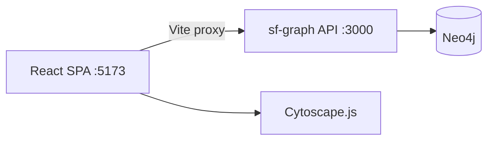

# Graph Visualization

The `web/` directory contains an interactive React SPA for visualizing Salesforce metadata as a graph.

## Overview



## Running Locally

```bash
# Terminal 1: API server
npm run dev

# Terminal 2: SPA
cd web && npm run dev
```

Open http://localhost:5173

## API Endpoints

### Search Objects
```
GET /objects?q=account&limit=10
```

### Get Object with Fields
```
GET /objects/Account?include=fields
```

Returns object metadata plus field details when `include=fields` is specified.

### Get Neighborhood Graph
```
GET /objects/Account/neighborhood?depth=2
```

Returns Cytoscape-compatible graph data:
```json
{
  "success": true,
  "centerObject": "Account",
  "depth": 2,
  "nodeCount": 45,
  "edgeCount": 78,
  "elements": {
    "nodes": [{ "data": { "id": "Account", "label": "Account", "isCenter": true } }],
    "edges": [{ "data": { "source": "Contact", "target": "Account", "label": "Account" } }]
  }
}
```

## Components

| Component | Purpose |
|-----------|---------|
| `GraphViewer` | Cytoscape canvas with concentric layout |
| `SearchBar` | Debounced autocomplete (300ms) |
| `ObjectPanel` | Selected node details, fields, relationships |
| `Toolbar` | Depth selector, zoom controls |
| `ErrorBoundary` | Graceful error handling |

## Hooks

| Hook | Purpose |
|------|---------|
| `useGraphData` | Fetch neighborhood with loading/error/retry |
| `useGraphNavigation` | URL params + localStorage persistence |
| `useDebouncedSearch` | setTimeout-based debounce |
| `useObjectFields` | Fetch fields on demand |

## State Persistence

- **URL params**: `?focus=Account&depth=2`
- **localStorage**: Last focused object remembered across sessions

## See Also

- [web/README.md](../web/README.md) — Frontend quick start
- [explorer.md](explorer.md) — TUI explorer documentation
