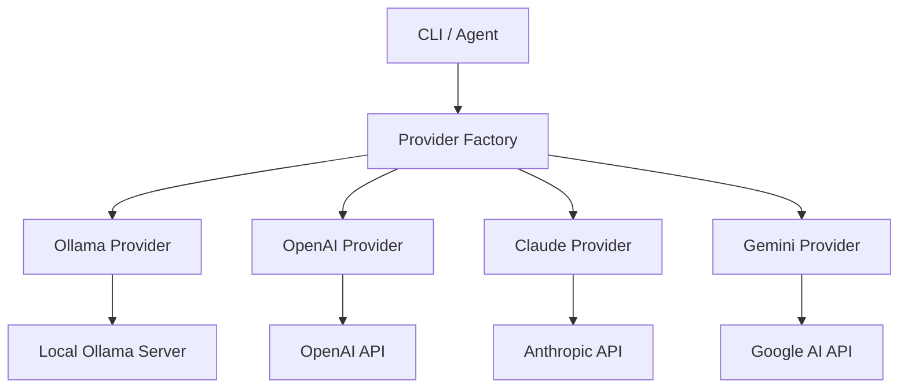
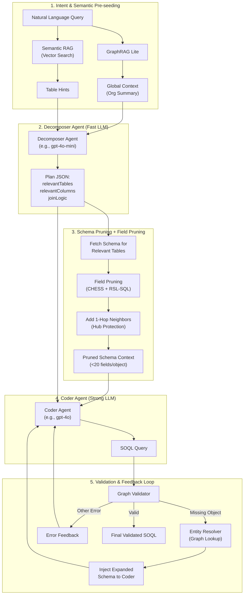
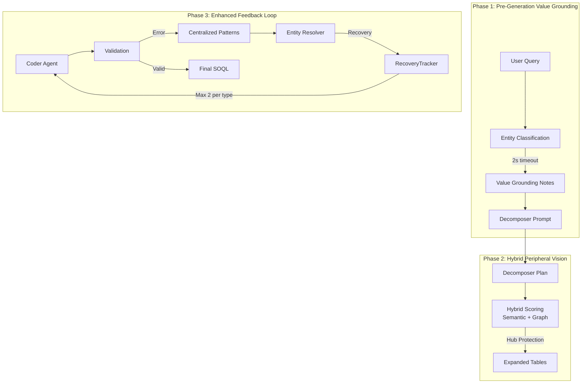
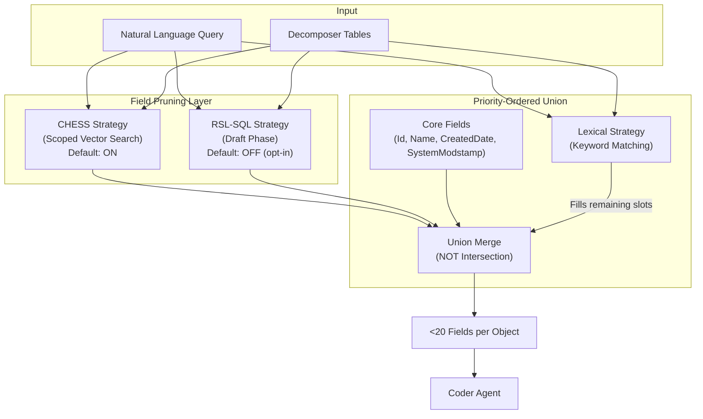

# LLM Integration

This document describes how the Salesforce Metadata Graph application integrates with LLMs.

## Overview

The application supports multiple LLM providers:

| Provider | Type | Config Key |
|----------|------|---------------------|
| **Ollama** | Local | `baseUrl` |
| **OpenAI** | Cloud | `openaiApiKey` |
| **Claude** | Cloud | `anthropicApiKey` |
| **Gemini** | Cloud | `googleApiKey` |

## Configuration Wizard

The easiest way to set up your LLM provider is using the interactive wizard:

```bash
sf graph ai config
```

This will guide you through:
1. Selecting a provider (Ollama, OpenAI, Claude, Gemini)
2. Setting the appropriate API key (masked input)
3. Configuring the model and base URL

> - `sf graph db config` - Setup Neo4j connection
> - `sf graph org config` - Select default Salesforce org

### Auto-Pull for Ollama

When you configure an Ollama model using `sf graph config set` or the wizard, the CLI will automatically check if the model exists locally. If not, it will pull the model for you:

```bash
# Automatically pulls qwen2.5:0.5b if missing
sf graph config set model qwen2.5:0.5b
```

This ensures your configured models are always ready to use.

## Quick Start
 
### Using Ollama (Default)
 
The system defaults to an **"Economic Arbitrage"** strategy using specialized Ollama models for different tasks:
 
| Role | Model | Task |
|------|-------|------|
| **Fast / Router** | `qwen2.5:3b` | Intent analysis, routing, decomposition (planning) |
| **Strong / Coder** | `qwen2.5-coder:14b` | Code generation, complex reasoning |
 
**Prerequisites:**
 
```bash
# Install and serve Ollama
ollama serve
 
# Pull the required models
ollama pull qwen2.5:3b
ollama pull qwen2.5-coder:14b
 
# Start chat
sf graph chat
```
 
### Using Cloud Providers
 
```bash
# OpenAI
sf graph config set openaiApiKey sk-...
sf graph config set model openai:gpt-4o
sf graph chat
 
# Claude
sf graph config set anthropicApiKey sk-ant-...
sf graph chat --provider claude
 
# Gemini
sf graph config set googleApiKey AIza...
sf graph chat --provider gemini
```
 
### Advanced Model Configuration (Economic Arbitrage)
 
You can assign different models to different agents to optimize for cost and performance. This is now pre-configured by default for Ollama but can be customized for any provider:
 
```bash
# Use a cheaper/faster model for planning (Decomposer)
sf graph config set decomposerModel openai:gpt-4o-mini
 
# Use a stronger model for code generation (Coder)
sf graph config set coderModel openai:gpt-4o
 
# Configure Context Window for Ollama (default: 16384)
sf graph config set ollamaNumCtx 32768
```
 
### Config File
 
Stored at `~/.sf-graph/agent-config.json`. Configure via `sf graph config set`.

```json
{
  "provider": "openai",
  "model": "gpt-4o",
  "confirmTools": false,
  "openaiApiKey": "sk-...",
  "defaultOrg": "my-org"
}
```

## Architecture



### Key Files

| File | Purpose |
|------|---------|
| `src/llm/types.ts` | Common interfaces |
| `src/llm/provider-factory.ts` | Provider instantiation |
| `src/llm/providers/*.ts` | Provider implementations |
| `src/agent/agent.ts` | Agentic chat with tool calling |

## Natural Language to SOQL (MAC-SQL Architecture)

The system generates SOQL from natural language using a **Multi-Agent Collaboration (MAC-SQL)** architecture. This approach uses specialized AI agents working in sequence, each optimized for a specific task, to achieve higher accuracy and efficiency than a single-prompt approach.



### Agent Roles

| Agent | LLM Model | Purpose |
|-------|-----------|---------|
| **Decomposer** | Fast (e.g., `gpt-4o-mini`) | **Planning Agent**. Analyzes the query, identifies required objects/fields, creates a structured plan. Uses MCP tools (`resolve-entity`, `list-objects`) to verify API names. |
| **Coder** | Strong (e.g., `gpt-4o`) | **Code Generation Agent**. Translates the plan into SOQL. Receives only the pruned schema context to minimize hallucination risk. Uses Chain-of-Thought reasoning. |

### Key Benefits

1.  **Schema Pruning**: The Coder only sees metadata for tables identified by the Decomposer, drastically reducing the "needle in a haystack" problem.
2.  **Latency Optimization**: The Decomposer uses a smaller, faster model for planning; the Coder uses a more powerful model for precise code generation.
3.  **Validation Retry Loop with Feedback**: If the generated SOQL fails graph validation, the errors are fed back to the Coder for correction (up to 3 retries). **NEW**: Missing objects detected during validation are automatically resolved and their schema is injected into the LLM context.
4.  **GraphRAG Lite**: For broad queries ("summarize my org"), global context from a `GlobalSummary` node is injected to guide the Decomposer.
5.  **Neighborhood Expansion**: 1-hop neighbors of Decomposer-selected tables are included for "peripheral vision" (with hub protection).
6.  **Semantic RAG**: Vector search pre-seeds table hints before decomposition (cold-start safe).

### Decomposer Output Format

The Decomposer returns a structured plan:
```json
{
  "summary": "Retrieve contact names and emails where Account is 'Microsoft'",
  "relevantTables": ["Contact", "Account"],
  "relevantColumns": ["Contact.Name", "Contact.Email", "Account.Name"],
  "joinLogic": "Join Contact to Account via AccountId"
}
```

### Pipeline Stages

1. **GraphRAG Lite** - Detects if the query has "global intent" (e.g., "summarize", "overview") and injects org-level context.
2. **Semantic RAG** - Pre-seeds table hints from vector search on object descriptions (cold-start safe).
3. **Decomposer Agent** - Plans the query, identifies required objects and fields.
4. **Schema Pruning** - Fetches only the relevant sub-graph from Neo4j.
5. **Field Pruning (CHESS + RSL-SQL)** - Reduces 500+ fields to <20 per object using scoped vector search and optional draft phase.
6. **Neighborhood Expansion** - Adds 1-hop neighbors for "peripheral vision" (capped at 20, filters system tables).
7. **Entity Classification** - Extracts potential filter values (e.g., company names, statuses) and grounds them against picklist values.
8. **Coder Agent** - Generates SOQL using the plan and pruned context.
9. **Validation & Feedback Loop** - Validates against the metadata graph; if errors, attempts to resolve missing objects and retries with expanded schema.

### Decomposer Bottleneck Mitigations

The Decomposer is the critical bottleneck - if it fails to identify necessary tables, the Coder cannot recover. Four strategies address this:

| Strategy | Description |
|----------|-------------|
| **Feedback Loop** | Missing objects from validation errors are resolved via graph and their schema is injected into the Coder's chat context. |
| **Neighborhood Expansion** | `get1HopNeighborSummaries()` adds related objects for "peripheral vision". Hub protection: caps at 20, filters `Share`/`Feed`/`History`/`ChangeEvent`. |
| **Semantic RAG** | `getSemanticTableHints()` uses vector search to pre-seed table hints. Cold-start safe: gracefully returns empty if embeddings unavailable. |
| **Ensemble Decomposition** | Opt-in (`ensembleDecomposition: true`): runs 3 parallel decomposers with varied prompts, unions `relevantTables`. Trade-off: 3x LLM calls. |
| **Ghost Object Pruning** | Objects with 0 fields (due to sync errors or disabled features) are automatically detected and pruned from the plan, preventing "Field not found" hallucinations. |

### Recall & Recovery Layer

The system implements a three-phase **Recall & Recovery Layer** to maximize schema coverage and minimize hallucinations:



#### Phase 1: Pre-Generation Value Grounding

Before decomposition, the system extracts and grounds potential filter values:

| Component | Description |
|-----------|-------------|
| `buildDecomposerGroundingContext()` | Classifies entities from the query and formats grounding notes |
| **2s Timeout** | Uses `Promise.race()` to prevent blocking the chat interface |
| **Grounding Notes** | Injected into Decomposer prompt with field-to-value mappings |

**Example grounding note:**
```text
VALUE GROUNDING NOTES:
- "Microsoft" found in Account.Name picklist values
- "High" found in Case.Priority picklist (value: "High")
```

#### Phase 2: Hybrid Peripheral Vision

Expands the Decomposer's table selection using **hybrid scoring** that combines semantic similarity with graph-based heuristics:

| Feature | Implementation |
|---------|----------------|
| **Hybrid Scoring** | `Score = (0.6 × Semantic) + (0.4 × Graph) + JunctionBonus` |
| **Semantic Component** | Vector similarity using object embeddings (falls back to Jaccard if unavailable) |
| **Graph Component** | Log-normalized relationship count: `log1p(count) / log1p(50)` |
| **Junction Detection** | Objects linking 2+ primary tables get +0.15 bonus |
| **Hub Object Protection** | Objects with >50 relationships capped at top 10 most relevant neighbors |
| **Batched Queries** | Single UNWIND Cypher for all neighbors (avoids N+1 problem) |

**How it works:**
1. For each table in the Decomposer's plan, fetch 1-hop neighbors
2. Batch-fetch semantic scores (exact embedding fetch, not ANN search) and graph signals in parallel
3. Compute hybrid score for each neighbor combining semantic relevance and structural importance
4. Junction objects (like `OpportunityContactRole`) get bonus even if semantically distant
5. If the object is a "hub" (>50 relationships), take only top 10 neighbors
6. Add high-scoring neighbors to the context (respecting budget)

**Why Hybrid over Jaccard?** Pure lexical matching (Jaccard) fails for semantically related but lexically different terms ("Revenue" vs "Amount"). It also misses structurally vital junction objects that connect primary tables.

#### Phase 3: Enhanced Feedback Loop

When validation fails, the system attempts intelligent recovery:

| Component | Description |
|-----------|-------------|
| **Centralized Error Patterns** | `src/core/validation-errors.ts` - single source of truth for error templates and regexes |
| **Entity Resolver** | `resolveMissingEntityExtended()` - resolves missing objects/relationships via graph |
| **Child Relationship Inference** | Automatically converts "OpportunityLineItems" → "OpportunityLineItem" (handles plural/`__r` suffixes) |
| **RecoveryTracker** | Prevents infinite loops by limiting recovery attempts |

**RecoveryTracker Limits:**
```typescript
const recoveryTracker = {
  resolvedObjects: new Set<string>(),      // Already injected objects
  resolvedRelationships: new Set<string>(), // Already injected relationships
  objectAttempts: 0,                        // Current count
  relationshipAttempts: 0,                  // Current count
  MAX_PER_TYPE: 2,                          // Max 2 attempts per entity type
};
```

**Recovery Flow:**
1. Validation fails with "Object 'Foo' not found"
2. `extractMissingEntityFromErrors()` extracts entity name using centralized patterns
3. `resolveMissingEntityExtended()` searches graph for the correct API name
4. If found and under attempt limit, schema is injected and Coder retries
5. If at limit or not found, error is returned to user

#### Key Files

| File | Purpose |
|------|---------|
| `src/core/validation-errors.ts` | Centralized error patterns (templates + regexes) |
| `src/services/entity-classifier.ts` | `buildDecomposerGroundingContext()` with timeout |
| `src/services/entity-resolver.ts` | `extractMissingEntityFromErrors()`, `resolveMissingEntityExtended()` |
| `src/services/soql-generator.ts` | `expandWithPeripheralVision()`, `RecoveryTracker` in `runCoder()` |
| `src/services/peripheral-vision/` | **Hybrid neighbor scoring** module |
| `src/services/peripheral-vision/hybrid-neighbor-scorer.ts` | Combines semantic + graph heuristics for neighbor scoring |
| `src/services/peripheral-vision/batch-graph-signals.ts` | Batched Cypher query for graph signals (junction detection) |
| `src/services/vector/batch-object-similarity.ts` | Exact embedding fetch + cosine similarity |
| `src/services/soql/lexical-scoring.ts` | Shared lexical scoring utility for field selection |

### Relationship Patterns

The system detects these natural language patterns:

| Pattern | Example | SOQL Output |
|---------|---------|-------------|
| Parent lookup | "contacts with account name" | `SELECT Account.Name FROM Contact` |
| Child subquery | "accounts with opportunities" | `SELECT (SELECT Name FROM Opportunities) FROM Account` |
| Multi-hop | "contacts with account owner" | `SELECT Account.Owner.Name FROM Contact` |
| Status filter | "high priority cases" | `WHERE Priority = 'High'` |
| Company filter | "microsoft deals" | `WHERE Account.Name LIKE '%Microsoft%'` |
| Semi-join filter | "accounts with open cases" | `WHERE Id IN (SELECT AccountId FROM Case WHERE Status = 'Open')` |
| Polymorphic Type | "contact tasks", "lead tasks" | `SELECT TYPEOF Who WHEN Contact THEN ... END` |

### Polymorphic Intelligence

The system includes specific logic to handle Salesforce polymorphic fields (like `Task.WhoId`, `Event.WhatId`, `OwnerId`) to prevent common LLM hallucinations:

1.  **Relationship Resolution**: Automatically maps `WhoId` → `Who`, `WhatId` → `What` using graph metadata or smart fallbacks.
2.  **TYPEOF Injection**: Dynamically injects syntax rules into the prompt only when polymorphic fields are present in the context.
3.  **Strict Syntax Rules**: Enforces the use of `TYPEOF` on the *Relationship Name* variables (e.g., `Who`) rather than the *Foreign Key* fields (`WhoId`).

**Example Prompt Injection:**
```text
POLYMORPHIC FIELD RULES:
- WhoId/WhatId are Foreign Key fields; Who/What are Relationship names.
- ❌ NEVER use dot notation on polymorphic FK fields: Task.WhoId.Name is INVALID
- ✅ USE 'TYPEOF' ON THE RELATIONSHIP NAME (not the Id field):
  CORRECT: SELECT TYPEOF Who WHEN Contact THEN FirstName, LastName END FROM Task
```

### SOQL Efficiency Rules

The schema context includes **cost indicators** to guide the LLM toward efficient query patterns:

| Pattern | Cost | When to Use |
|---------|------|-------------|
| **Dot notation** | Low | Always prefer for parent field access (`Account.Name`) |
| **Semi-join** | Low | Filtering by child criteria without returning child data |
| **Child subquery** | Moderate | Only when user explicitly requests a *list* of related items |

**Key rules enforced:**
1. **Never use subqueries for parent objects** - `(SELECT Name FROM Account)` is invalid SOQL
2. **Semi-joins prevent empty results** - Use `WHERE Id IN (SELECT...)` instead of child subqueries when filtering
3. **Grain first** - Determine the primary object before constructing the query

### Picklist Value Discovery

The system automatically:
- Extracts status/priority keywords (`high`, `low`, `open`, `closed`, etc.)
- Extracts company names from patterns like "for Microsoft deals"
- Matches extracted values against active picklist values in the graph
- Provides hints to the LLM for accurate filter generation


### Semantic Knowledge Graph

The system uses a **Semantic Knowledge Graph** for intelligent entity resolution:

- **Hybrid Search (Resilience)**: Combines **Vector Similarity Search** (High Recall) with **Heuristic/Exact Matching** (High Precision).
   - If Vector Search fails (e.g., service down), the system transparently falls back to Heuristic Matching, ensuring no interruption in service.
   - Results from both methods are verified against the graph and merged.
- **Hybrid Short-Circuit Strategy**: Exact match first (O(1), 100% confidence), then **Configurable Synonyms** (via `synonyms.ts`), then fuzzy match, then vector similarity search (~300ms) as fallback.
- **Value-Based Grounding**: Values like "Microsoft" or "High Priority" are grounded against picklist values and instance data.
- **SOSL Fallback**: When the graph identifies a target object (e.g., Account) but finds no picklist match, the system executes a scoped Salesforce SOSL search to verify the record exists.
- **Schema Categorization**: Objects and fields are automatically categorized (business_core, system_derived, etc.) using heuristic analysis of the graph structure. Run `sf graph categorize` or use `sf graph sync --categorize` to populate categories.

### Category-Based Confidence Modifiers

To prevent system objects from incorrectly matching business queries, the grounding service applies **category-based confidence modifiers** to picklist matches:

| Category | Modifier | Effect |
|----------|----------|--------|
| `business_core` | 1.0 | Full confidence for core CRM objects |
| `business_extended` | 0.9 | Slight penalty for custom objects |
| `system` | 0.3 | Heavy penalty for system/admin objects |
| `system_derived` | 0.3 | Heavy penalty for Feed/History/Share objects |
| `managed_package` | 0.7 | Moderate penalty for managed packages |
| `custom_metadata` | 0.4 | Low - metadata types rarely queried |
| `platform_event` | 0.2 | Very low - cannot be queried with SOQL |

**Example:** When querying "show me microsoft deals":
- `AuthProvider.ProviderType='Microsoft'` gets 0.95 × 0.3 = **0.285** (system object)
- SOSL fallback finds `Account.Name='Microsoft'` with **0.85** confidence
- Result: Account wins, query uses `WHERE Account.Name LIKE 'Microsoft%'`

The schema context also **filters out excluded categories** (`system`, `system_derived`, `platform_event`, `custom_metadata`) from business query contexts, preventing them from appearing in the LLM prompt.

### Field Pruning Strategies (CHESS + RSL-SQL)

To solve the "Context Window" problem (500+ fields per object overwhelming the LLM), the system employs two complementary field pruning strategies that reduce fields to <20 per object:



#### Strategy 1: CHESS (Hierarchical Column Pruning)

**Default: ON** (`enableChessPruning: true`)

Uses scoped vector search to find semantically relevant fields:

1. Generate embedding for the user's query
2. Search the `field_embedding` index with filter: `{ sobjectType: tableName }`
3. Return top N fields with highest semantic similarity
4. Always include Core Fields for query viability

```typescript
// Example: Query "Show me the revenue for closed deals"
// CHESS finds: Amount, StageName, CloseDate (semantic match to "revenue", "closed")
```

#### Strategy 2: RSL-SQL (Backward Pruning)

**Default: OFF** (opt-in with `enableDraftPhase: true`)

Uses a fast model to generate a draft SOQL, then extracts the fields it actually used:

1. Fast model (e.g., `qwen2.5:3b`) generates rough SOQL draft
2. Token-based extraction captures field names (tolerates syntax errors)
3. Validates tokens against known schema fields (filters hallucinations)
4. Returns only fields the LLM actually tried to use

```typescript
// Example: Draft "SELECT Id, Amount, CloseDate FROM Opportunity WHERE StageName = 'Closed Won'"
// Extracts: Id, Amount, CloseDate, StageName (validated against schema)
```

#### Merge Strategy: Priority-Ordered Union

The system uses **Union** (not Intersection) to avoid context starvation:

| Source | Priority | Rationale |
|--------|----------|-----------|
| Core Fields | Always (~5 slots) | Query viability (Id, Name, CreatedDate, SystemModstamp) |
| CHESS Fields | High | Semantic vector similarity (primary strategy) |
| Draft Fields | High | LLM explicitly selected these fields (if enabled) |
| Lexical Fields | Lower | Keyword matching fills remaining slots only |

**Why Union, not Intersection?** If the draft model hallucinates (e.g., `Total_Value__c` instead of `Amount`), Intersection would remove `Amount` from the final set, causing the Coder to fail. Union preserves both strategies' contributions.

**Lexical as Safety Net:** The lexical strategy (`src/services/soql/lexical-scoring.ts`) provides high recall for exact name matches (e.g., "Revenue" → `Revenue__c`). It only fills remaining slots after CHESS and Draft, ensuring semantic hits are never crowded out by low-value lexical matches.

#### Configuration

```bash
# Enable draft phase (opt-in)
sf graph chat --enableDraftPhase

# Adjust max fields per object (default: 15)
sf graph chat --maxFieldsPerObject 20

# Disable CHESS pruning (use heuristic only)
sf graph chat --enableChessPruning false
```

Or programmatically:

```typescript
await generateSoqlFromNaturalLanguage(query, {
  enableChessPruning: true,   // Default ON
  enableDraftPhase: true,     // Opt-in
  maxFieldsPerObject: 15,     // Default 15
});
```

#### Key Files

| File | Purpose |
|------|---------|
| `src/services/soql-draft-utils.ts` | Core fields constant, token-based column extraction |
| `src/services/field-pruning/scoped-vector-search.ts` | CHESS strategy implementation |
| `src/services/soql-generator-draft.ts` | RSL-SQL draft phase service |
| `src/services/soql-generator.ts` | Integration and merge logic |
| `src/services/soql/lexical-scoring.ts` | Lexical strategy (keyword matching for field selection) |

### Semantic Field Selection

To maximize LLM accuracy while respecting context limits (approx. 25 fields per object), the system employs a **Semantic Field Selection** strategy:
- **Relevance Scoring**: Fields are scored based on how well they match the user's natural language query (Exact match > Partial match > Description match).
- **Core Fields**: Essential fields like `Id`, `Name`, `CreatedDate`, and `SystemModstamp` are always included.
- **Smart Truncation**: High-relevance fields are preserved even when the object has hundreds of fields, ensuring the LLM has the necessary context to answer specific questions (e.g., about "Revenue Schedule").

### Key Components

| File | Purpose |
|------|---------|
| `src/services/soql-generator.ts` | **MAC-SQL orchestrator** with `runDecomposer`, `buildPrunedSchemaContext`, `runCoder`. |
| `src/services/soql/prompts.ts` | **Centralized LLM Prompts** for Decomposer and Coder agents. |
| `src/services/field-pruning/` | **CHESS strategy** (scoped vector search) for semantic field pruning |
| `src/services/soql-generator-draft.ts` | **RSL-SQL strategy** (draft phase) for backward field pruning |
| `src/services/soql-draft-utils.ts` | **Core fields** constant, token-based column extraction |
| `src/services/graph-rag-service.ts` | **GraphRAG Lite** for global intent detection and org-level context |
| `src/services/schema-context/` | Entity extraction, **semantic field selection**, picklist discovery, **category-based filtering** |
| `src/config/synonyms.ts` | **Configurable Synonyms** mapping business terms ("deals") to technical objects |
| `src/services/dynamic-synonym-service.ts` | **Semantic entity resolution** wrapper using hybrid short-circuit strategy |
| `src/services/grounding/value-grounding-service.ts` | **Value grounding** with tiered strategy, **category-based confidence modifiers** |
| `src/services/categorization/heuristic-tagger.ts` | Auto-categorization rules for objects (business_core, system, etc.) |
| `src/services/semantic/semantic-search-service.ts` | **Vector similarity search** for semantic matching |
| `src/core/validation-errors.ts` | **Centralized validation error patterns** - single source of truth for error templates and regexes |
| `src/services/soql-validator.ts` | Modular SOQL validation with **AST parsing**, **JIT API fallback** for relationships, and picklist validation. |
| `src/services/soql/ast-mutations.ts` | **AST-based SOQL repair** - mutates parsed queries in-place, avoiding regex corruption of string literals and aliases. |
| `src/services/soql-ast-parser.ts` | Wraps `@jetstreamapp/soql-parser-js` for accurate WHERE clause parsing |
| `src/services/entity-classifier.ts` | **Entity classification** using grounding service, `buildDecomposerGroundingContext()` with 2s timeout |
| `src/services/entity-resolver.ts` | **Graph-based entity resolution** with `resolveMissingEntityExtended()`, **child relationship inference** |
| `src/services/neo4j/graph-service.ts` | Provides relationship paths, picklist lookups, and **1-hop neighbor summaries** |

### Strict Validation & Safety

To prevent common LLM hallucinations, the system enforces strict validation rules. If these rules are violated, the validator returns a hard error (not a warning), forcing the LLM to retry with a correct strategy.

**Note:** Unknown field references and invalid parent lookups now trigger **Errors**, preventing the execution of hallucinated queries.

| Rule | Description | Valid Example | Invalid Example |
|------|-------------|---------------|-----------------|
| **No ID Guessing** | 15 or 18-character ID literals are strictly forbidden unless they are part of a semi-join. The LLM must filter by Name or external ID. | `WHERE Owner.Name LIKE 'Nathan%'` | `WHERE OwnerId = '005...'` |
| **No "IS NOT EMPTY"** | The `IS NOT EMPTY` syntax is not supported in SOQL. Use semi-joins instead. | `Id IN (SELECT AccountId FROM Case)` | `(SELECT Id FROM Cases) IS NOT EMPTY` |
| **No Unknown Relationships** | Subqueries must use the correct child relationship name from the schema. | `(SELECT Id FROM Contacts)` | `(SELECT Id FROM Contact)` |
| **Valid Picklist Values** | Picklist filters must use valid values. **AST-parsed, returns errors.** | `WHERE Status = 'Closed'` | `WHERE Status = 'Klosed'` |
| **Aggregate Grouping** | Non-aggregated fields in a query with aggregates MUST be grouped. | `SELECT StageName, COUNT(Id) ... GROUP BY StageName` | `SELECT StageName, COUNT(Id) ...` |
| **Tooling API Constraints** | EntityDefinition, FieldDefinition forbid `COUNT()`, `GROUP BY`, `LIMIT`, `OFFSET`, `OR`, `!=`. | `SELECT QualifiedApiName FROM EntityDefinition WHERE KeyPrefix = '001'` | `SELECT COUNT() FROM EntityDefinition` |
| **Governor Limits** | Auto-adds `LIMIT 1000` to queries without LIMIT. Warns on leading wildcards (`LIKE '%...'`). Skips auto-LIMIT for Tooling API objects. |
| **Ghost Objects** | If an object exists in the graph but has 0 fields (e.g. `OpportunityTeamMember` when generic "Team Selling" is disabled), the system strictly forbids its usage, forcing the LLM to find an alternative strategy. | `SELECT Id FROM Account LIMIT 100` | `SELECT Id FROM Account` (auto-corrected) |

### Smart Suggestions

When the validator detects an invalid parent lookup (e.g., `Accnt.Name` instead of `Account.Name`), it uses **multi-stage fuzzy matching** to find the intended relationship:

1. **Exact match** on relationship name (case-insensitive)
2. **Target object match** – e.g., `Account` matches a relationship targeting Account
3. **Fuzzy matching** using Levenshtein distance on both relationship names and target objects
4. **Partial matching** – `startsWith` and `contains` checks

If a close match is found, the validator **automatically corrects** the SOQL query using **AST mutations** (not regex) and reports a correction message (e.g., `Relationship "Accnt" corrected to "Account"`). AST-based corrections ensure string literals and aliases are never accidentally modified. If no match is found, it provides helpful suggestions listing available relationships.

## Troubleshooting

| Issue | Solution |
|-------|----------|
| Provider not available | Check API key or Ollama status |
| Model not found | Verify model name for provider |
| Slow response | Use smaller model or local Ollama |
| Local model refuses queries | Try `mistral` or `qwen2` instead of `llama3` - some models are overly cautious with company/person names |
| Model ignores SOQL instruction | The system embeds instructions in the prompt to improve compliance with local models |

